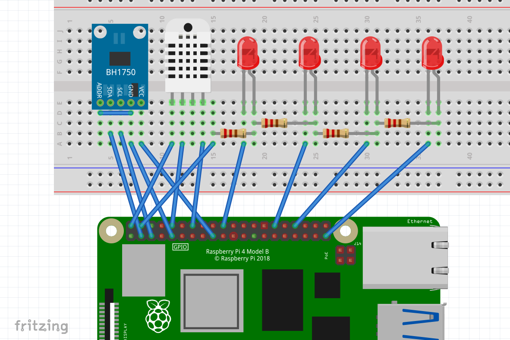

# IOT dashboard

IOT server that show temperature, humidity and light.


## Prerequisits

To run this project, you will need to have these tools installed:

`NodeJS`

`MySQL`

`adafruit_dht` on your raspbery pi

`smbus` on your raspbery pi

`paho-mqtt` on your raspbery pi

## Wiring



## Run Locally

Before startting, copy file "raspberry pi" to your raspberry pi

Start the server:

Go to the project directory

```bash
  cd iot_dashboard
```

on your PC, run 3 terminal:
```bash
  node fetch.js
```
```bash
  python code/iot_dashboard_sub.py
```
```bash
  python code/status_sub.py
```
on your raspberry pi, run 2 terminal:
```bash
  python raspberry pi/iot_dashboard_sub.py
```
```bash
  python raspberry pi/ iot_dashboard_pub.py
```

Open index.html to see the result